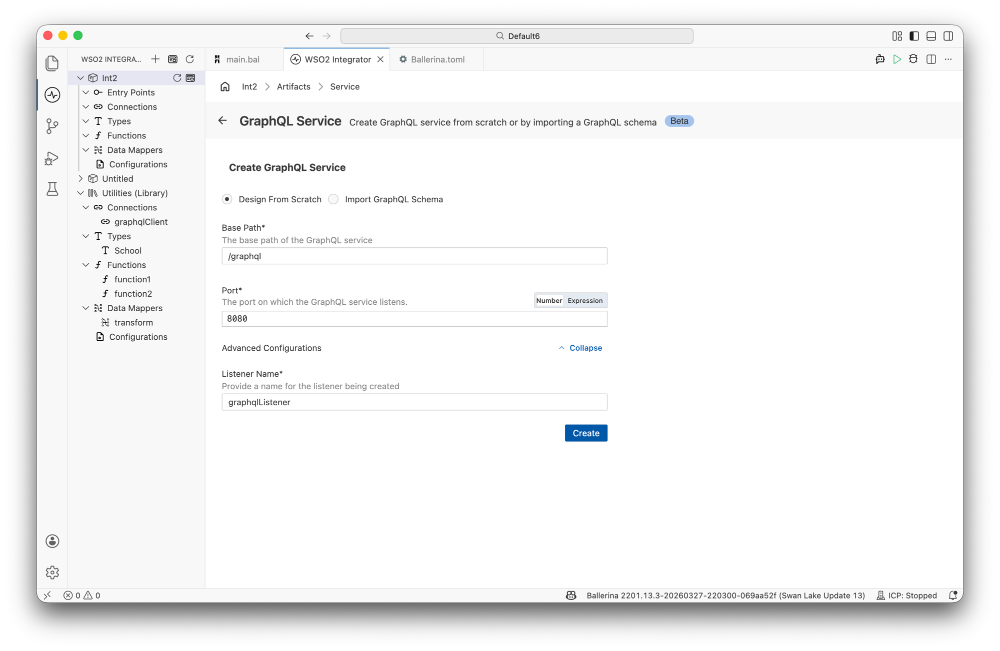
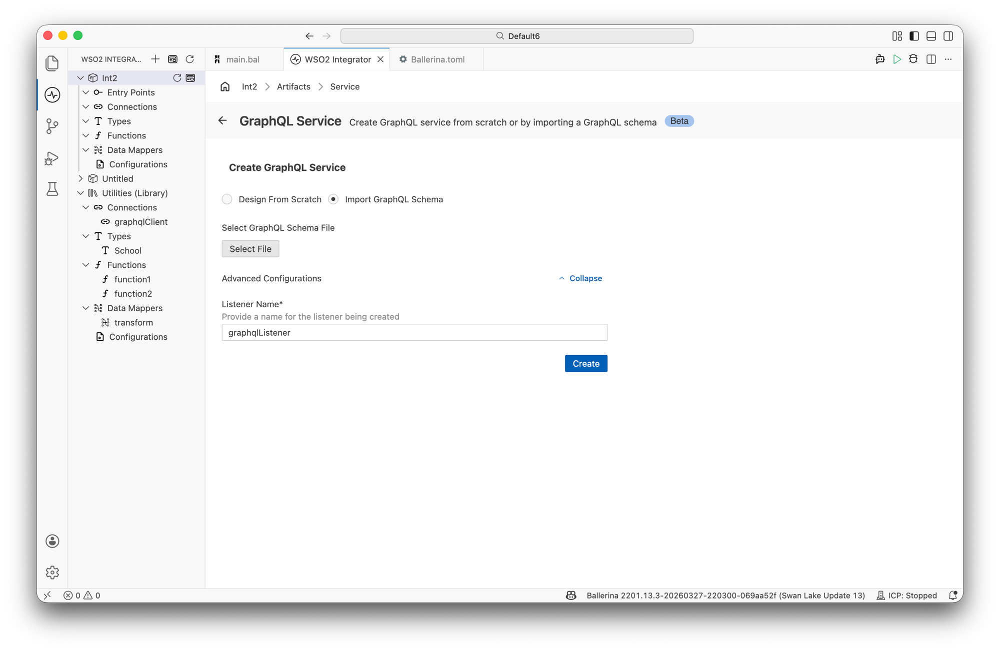
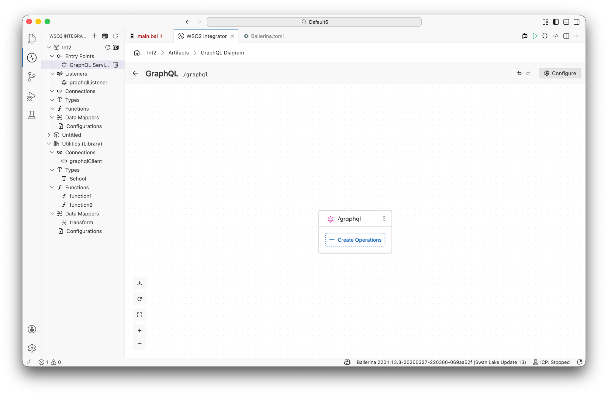
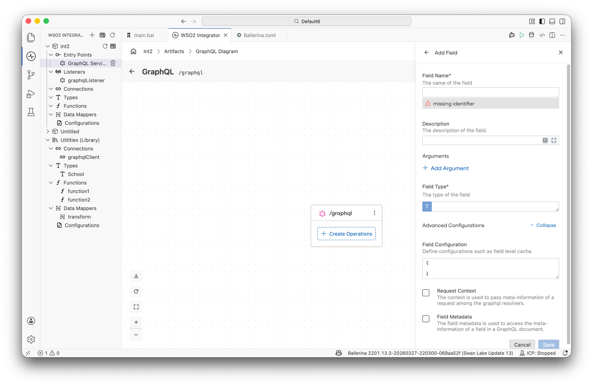
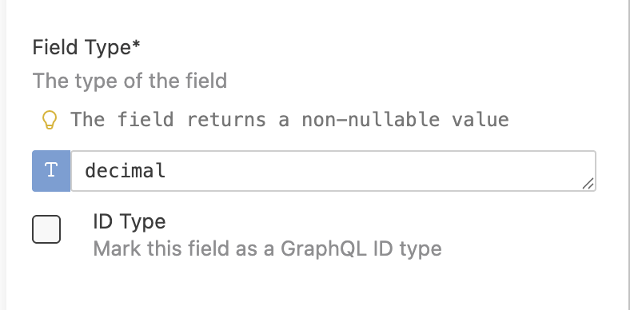
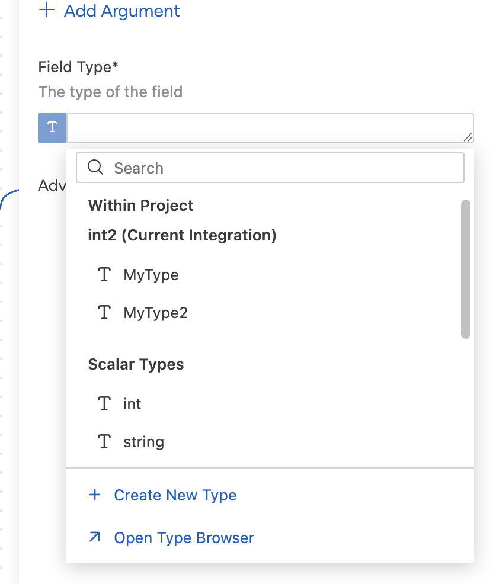
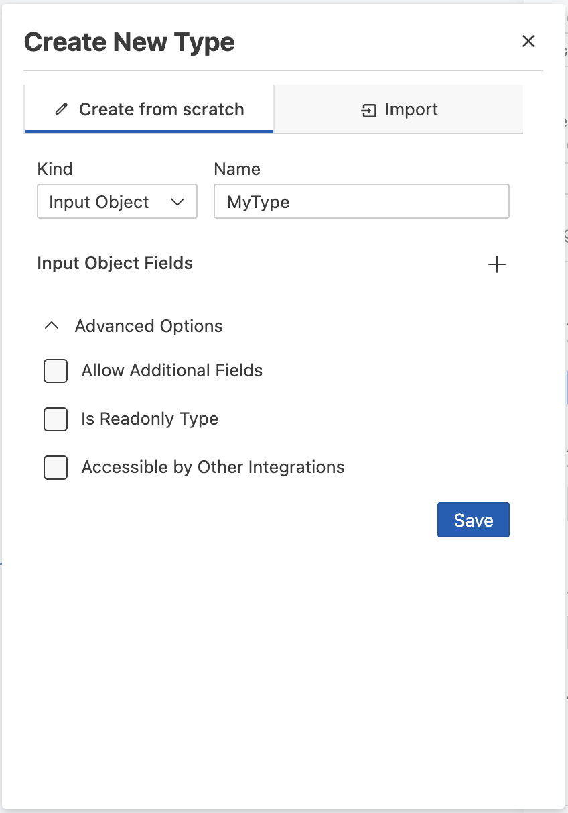
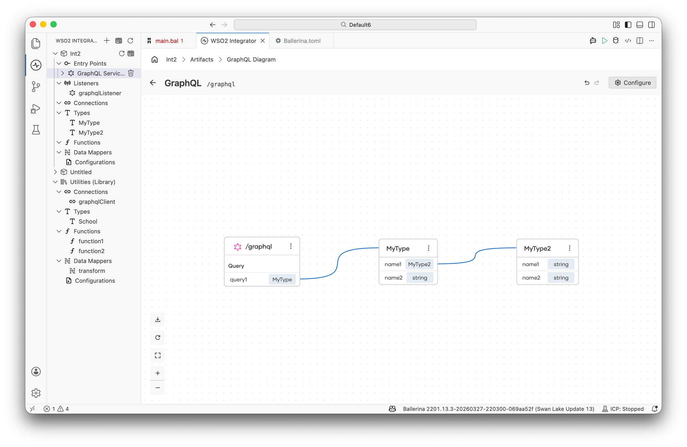
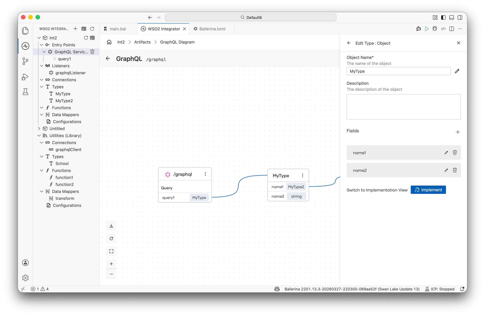
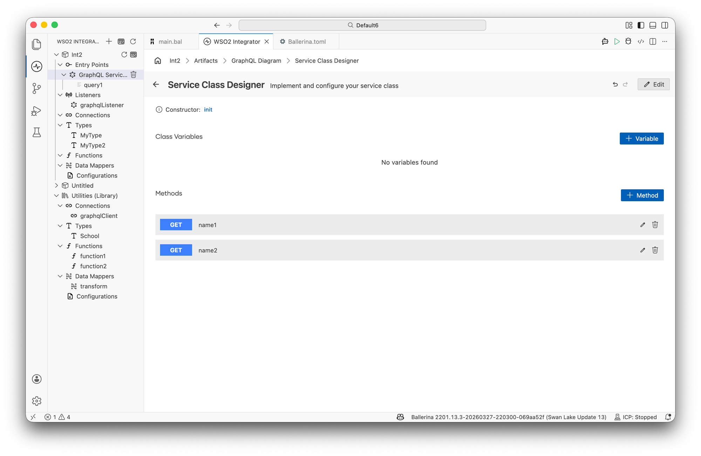

import Tabs from '@theme/Tabs';
import TabItem from '@theme/TabItem';

# GraphQL Service

GraphQL services let you build flexible APIs where clients request exactly the data they need. WSO2 Integrator supports designing a GraphQL service from scratch or importing an existing GraphQL schema file, and provides a visual canvas to model your schema and implement resolver logic.

:::note Beta
GraphQL service support is currently in beta.
:::

## Creating a GraphQL service

<Tabs>
<TabItem value="ui" label="Visual Designer" default>

You can create a GraphQL service by designing it from scratch or by importing an existing GraphQL schema file.

**Design from scratch**

1. Open the **WSO2 Integrator** sidebar in VS Code.
2. Click **+** next to **Entry Points**.
3. Select **GraphQL Service**.
4. Select **Design From Scratch**.
5. Fill in the required fields:

   | Field | Description | Default |
   |---|---|---|
   | **Base Path** | Endpoint path for the service | `/graphql` |
   | **Port** | Listener port | `8080` |

6. Optionally expand **Advanced Configurations** and set the **Listener Name** (default: `graphqlListener`).
7. Click **Create**.



**Import from schema**

1. Select **Import GraphQL Schema** on the creation form.
2. Click **Select File** and choose your `.graphql` schema file.
3. Optionally expand **Advanced Configurations** and set the **Listener Name**.
4. Click **Create**.



</TabItem>
<TabItem value="code" label="Ballerina Code">

```ballerina
import ballerina/graphql;

configurable int port = 8080;

listener graphql:Listener graphqlListener = new (port);

service /graphql on graphqlListener {
    // Add query, mutation, and subscription fields
}
```

</TabItem>
</Tabs>

## GraphQL diagram

After creating the service, WSO2 Integrator opens the **GraphQL diagram** — a canvas that visualizes your service structure, including all operation types (Query, Mutation, Subscription) and the GraphQL types they reference.



Use the **Configure** button in the top right to open the service configuration view.

## Service configuration

The **GraphQL Service Configuration** view is opened via the **Configure** button on the GraphQL diagram. It has two sections in the left navigation: **GraphQL Service** and the attached listener (for example, **graphqlListener**).

### GraphQL service settings

| Field | Description |
|---|---|
| **Service Base Path** | The base endpoint path for the GraphQL service (for example, `/graphql`) |
| **Service Configuration** | Service-level settings such as maximum query depth (JSON record) |

The **Configuration for graphqlListener** section on the same panel shows:

| Field | Description |
|---|---|
| **Name** | Name of the attached listener |
| **Listen To** | An `http:Listener` or a port number to listen to the GraphQL service endpoint |
| **Host** | The host name or IP address of the endpoint |

### Listener configuration

Select the listener (for example, **graphqlListener**) in the left navigation to configure its HTTP settings:

| Field | Description | Type |
|---|---|---|
| **HTTP1 Settings** | Configurations related to HTTP/1.x protocol | Record |
| **Secure Socket** | SSL/TLS configurations for the service endpoint — required for HTTPS | Record |
| **HTTP Version** | Highest HTTP version supported by the endpoint | Select |
| **Timeout** | Time in seconds a connection waits for a read/write operation; use `0` to disable | Number |
| **Server** | Server name to appear as a response header | Text |
| **Request Limits** | Configurations associated with inbound request size limits | Record |
| **Graceful Stop Timeout** | Grace period in seconds for a graceful listener stop | Number |
| **Socket Config** | Server socket configuration settings | Record |
| **HTTP2 Initial Window Size** | Initial window size for HTTP/2 connections | Number |
| **Min Idle Time In Stale State** | Minimum time in seconds to keep an HTTP/2 connection open after receiving a GOAWAY; set to `-1` to close after all in-flight streams complete | Number |
| **Time Between Stale Eviction** | Interval in seconds between HTTP/2 stale connection eviction runs | Number |

Click **Save Changes** to apply the configuration. Use **+ Attach Listener** at the bottom of the listener panel to attach an additional listener to the service.

## Creating operations

<Tabs>
<TabItem value="ui" label="Visual Designer" default>

1. In the GraphQL diagram, click **+ Create Operations** on the service card.
2. The **GraphQL Operations** panel opens on the right, showing **Query**, **Mutation**, and **Subscription** sections.
3. Click **+** next to the relevant operation type to add a field to it.


</TabItem>
<TabItem value="code" label="Ballerina Code">

```ballerina
service /graphql on graphqlListener {

    // Query
    resource function get product(string id) returns Product|error {
        return getProduct(id);
    }

    // Mutation
    remote function createProduct(ProductInput input) returns Product|error {
        return addProduct(input);
    }

    // Subscription
    resource function subscribe onProductCreated() returns stream<Product, error?> {
        return getProductStream();
    }
}
```

</TabItem>
</Tabs>

### Operation types

| Operation | Ballerina keyword | Description |
|---|---|---|
| **Query** | `resource function get` | Read data — analogous to HTTP GET |
| **Mutation** | `remote function` | Write data — analogous to HTTP POST/PUT/DELETE |
| **Subscription** | `resource function subscribe` | Real-time updates via WebSocket |

## Adding fields to an operation

<Tabs>
<TabItem value="ui" label="Visual Designer" default>

After clicking **+** next to an operation type, the **Add Field** panel opens on the right.

| Field | Description |
|---|---|
| **Field Name** | Name of the field (required) |
| **Description** | Optional description shown in the schema |
| **Arguments** | Input arguments — click **+ Add Argument** to add each one |
| **Field Type** | Return type of the field (required) |
| **Field Configuration** | Field-level settings such as cache configuration (JSON) |
| **Request Context** | Pass meta-information of a request among GraphQL resolvers |
| **Field Metadata** | Access meta-information of a field in a GraphQL document |

Click **Save** to add the field.



</TabItem>
<TabItem value="code" label="Ballerina Code">

```ballerina
service /graphql on graphqlListener {

    resource function get product(string id) returns Product|error {
        return getProduct(id);
    }
}
```

</TabItem>
</Tabs>

## Field types

### Scalar types

For basic scalar types (`int`, `decimal`, `float`, `string`), the field type editor displays an **ID Type** checkbox to mark the field as a GraphQL ID type. All field types support a **Nullable** option to allow null values.



### Complex types

When setting a field type, the type picker shows a dropdown of available types grouped by:

- **Within Project** — types defined in the current integration
- **Scalar Types** — built-in scalar types (`int`, `string`, etc.)
- **+ Create New Type** — create a new type inline
- **↗ Open Type Browser** — browse all available types



:::note Type constraints
For **output field types**, WSO2 Integrator supports Object, Enum, and Union types. For **argument types**, only Input Object and Enum types are supported.
:::

When you click **+ Create New Type**, a dialog opens where you can select a **Kind**, provide a **Name**, define fields, and configure advanced options such as **Allow Additional Fields**, **Is Readonly Type**, and **Accessible by Other Integrations**.



## Type canvas

As you add fields with complex return types, the canvas displays a type diagram showing the nested structure of your GraphQL types. Each type appears as a node with its fields and their types listed, with connector lines showing relationships between them.



## Implementing service logic

### Editing a type

To edit a type shown in the canvas, click the three-dot menu (**⋮**) on a type node. The **Edit Type** panel opens on the right, showing the type name, description, and fields. You can add, edit, or delete fields from this panel.



### Service class designer

Click **Implement** in the **Edit Type** panel to open the **Service Class Designer**. This view lets you:

- Manage **class variables** using **+ Variable**
- View resolver methods generated for each field — displayed as **GET** methods
- Add additional methods using **+ Method**



Click any resolver method to navigate to the **flow diagram view**, where you can define the integration logic for that resolver using the visual designer.
